

### Panarthropoda, Arthropod general & Chelicerates  
\
**30 September, 2016**  
**Associated Readings:  Pechenik Ch 14, 341-358, Ch 15**  
\
This week’s lab introduces you to the “Panarthropoda”, a set of ecdysozoan phyla that includes the arthropods and closely related lineages. We’ll also begin our focus on Arthropoda with an introduction to the chelicerates – the subphylum that includes arachnids.  
\
Included in the lab are drawings of external anatomy, looking at slides and preserved specimens, identifying spiders using a dichotomous key, and behavioral and anatomical demonstrations of extremely cool spiders and their relatives. There are 
**4 required drawings for this lab**
and a few other recommended sketches.  Take time to marvel at the diversity represented in this most remarkable group of organisms.  
\
The organisms you will be looking at fall within the following taxonomic groups: 

  * **Ecdysozoa**
  * **Panarthropoda**
  * **Phylum Tardigrada (slides and live specimens)**
  * **Phylum Onycophora (preserved specimens and slides)**
  * **Phylum Arthropoda**
    + **SubPhylum Trilobitomorpha  (extinct) – see fossils**         
    + **SubPhylum Chelicerata**
    + + **Class Merostomata** - Horse shoe crabs
    + + **Class Pycnogonida** - Sea spiders
    + + **Class Arachnida** - Spiders (list of Families in collection in lab)
    + + + **Order Araneae**
    + + + + **Superfamily Mygalomorphae** (Orthognatha)
    + + + + **Superfamily Araneomorphae** (Labidognatha)
    + + + **Order Scorpiones** - Scorpions
    + + + **Order Opiliones** - Harvestmen
    + + + **Order Acari** - Ticks, mites
    + + + **Order Amblypygi** - Tailless whip scorpions
    + + + **Order Solpugida** - Sun spiders
    + + + **Order Schizomida** - Schizomids
    + + + **Order Pseudoscorpiones** - Pseudoscorpions
    + + + **Order Uropygi** - Whip scorpions

\
***Objectives***  
After this lab, you should:  
1.  Be able to identify specimens representing the taxa above that are in bold print.  
2.  Recognize the external and internal anatomy of an onycophoran (from cross section)  
3.  Be able to identify live tardigrades and arachnids  
4.  Be able to identify the following structures on any chelicerate:
	prosoma, opisthosoma, chelicerae, pedipalps, and 4 pair of walking legs.  
5.  Know the external anatomy of a spider and of a scorpion.  
6.  Understand how to use a dichotomous key to identify organisms.  

   

#### Phyla Onychophora and Tardigrada (included in Panarthropoda) (Ch 15) 

These are two small groups that historically had unclear evolutionary relationships to other invertebrates.  Recent molecular phylogenetic analyses strongly supports these two phyla as being relatives of arthropods with onychophorans the sister group to arthropods, and Tardigrades sister to that group.  Fossil evidence suggests that onychophorans have undergone very little phenotypic change and they are considered by some as "living fossils" and a "missing link" between annelids and arthropods.  
 

##### Phylum Onychophora 
Diversity:  approx 100 species described  
Humid habitats mostly in the tropics  
Important Characteristics:

  * soft body, thin cuticle of not-articulating plates; grow by molting; little cephalization; 3 paired appendages on head - **fleshy antennae**, pair of **jaws**, pair of **oral papillae; appendages unjointed; paired segmental nephridia; tracheae-spiracular system; reduced coelom; slime glands.**

\
***Drawing 4.1 Internal anatomy of Onycophora.***  

* Look at a cross section of *Peripatus*. Draw this and label the **heart (dorsal vessel), circular muscles, longitudinal muscles, nerve cord, leg, gut, body cavity, cuticle.** You may or may not be able to see uterus or testes depending on the where the slice was taken to make the slide. Refer to figure 15.4 of Pechenik and the figures below.

\
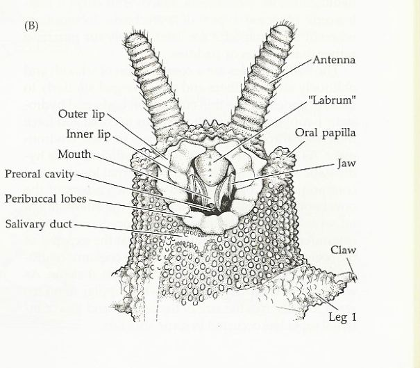
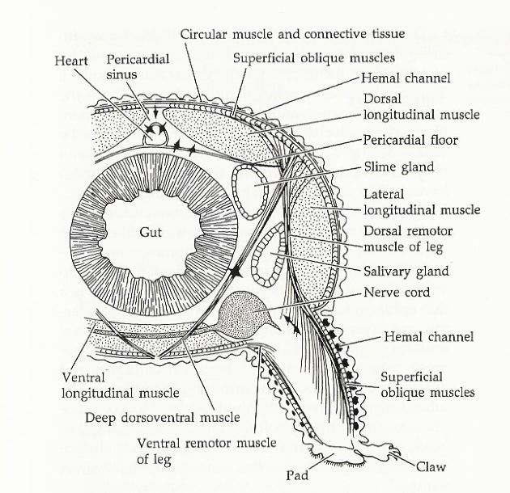
\
**See the preserved specimen of Onychophora. We only have two – please be careful with them and return them promptly if you take them to the microscope.**
  

##### Phylum Tardigrada 
Diversity:  > 900 species described  
Semiaquatic habitats - water films on mosses and plants, soil and forest litter  
Important Characteristics:  

* **4 pairs of ventral legs, each ending in 1 to many (12) "toes" with adhesive pads or claws;** body covered by thin cuticle occasionally divided into plates;  growth by **molting; coelom reduced;** no curculatory or gas exchange systems (they're very small- 0.1 to 0.5 mm); nervous system metamerous; **gonochoristic.**

\
Tardigrades are called "water bears" due to the presence of "claws" on their eight legs and their slow, lumbering movements.  In times of low water availability they form dormant cysts called tuns.  In this state the tardigrades are dessicated and have an extremely low level of metabolism.   Tuns are very resistent to extreme temperature (+149°C - -272°C), chemicals, radiation and lack of oxygen. 
\
\
See Pg. 422, Fig 15.3 for additional images.   Can you believe how cute these are and that we’re surrounded by them. How lucky are we!  
\
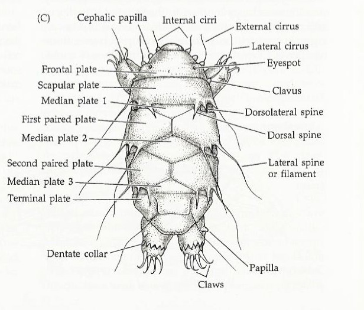
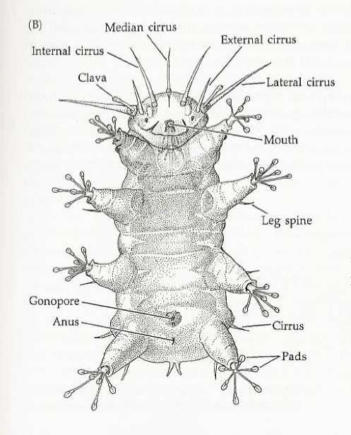
\
\
See the slides of tardigrades in the teaching collection, and be able to identify them. Try to zoom in on their toes and see their eyes. The morphology is hard to see so I won’t have you draw them.  
**Everyone is required to see live Tardigrades from moss collected from trees on campus. To do this:**

1. Collect moss from a tree and immerse it in water in a watch glass.
2. After about 30 minutes, place a droplet of water with a bit of moss onto a depression slide.
2. Look at it under 10x magnification
3. Look for transparent animals with legs that are bumbling over the moss.
\
**(Note - you may also see nematodes and rotifers on the moss.)**  

   

#### Phylum Arthropoda  
Diversity:  immense - estimated 3-100 million insect species alone!  
found in virtually every habitat imaginable.  
Important characteristics:  

* **segmentation** with **regional body specialization** and **tagmosis; exoskeleton with thick scleratorized plates; jointed appendages; protostomes;** complete digestive tract; **open circulatory system;**  well developed nervous system; **gonochoristic; growth by molting.**

 

##### Subphylum Cheliceriformes  
Diversity:  over 80,000 described species  
mostly terrestrial  
Important characteristics:  

* body divided into two main regions, **prosoma (or cephalothorax)** and **opisthosoma (or abdomen);**  opisthosoma usually bears **telson;** prosoma is tagmosis of 6 segments, first pair of appendages is **chelicerae** followed by **pedipalps** then 4 pairs of walking legs; opisthosoma is composed of 12 segments;  gas exchange by **book gills, book lungs, or tracheae.**

 

##### Class Merostomata  
Diversity:  4 living species.  
Important characteristics:  

* Prosomal carapace; pedipalps similar to walking legs; opisthosoma divided as mesosoma and metasoma, or undivided; book gills; long, spiked telson.

***Drawing 4.2	Drawing of Meristomata Limulus external morphology (dorsal and ventral view)***

* Draw and label the following structures as on the figures below.  **Prosoma, opisthosoma, median eyes, lateral compound eyes, telson, chelicera, pedipalp, gnathobase, carapace, chelate walking legs.** Note how they differ from the other chelicerates in the collection. (Fig 14.10)

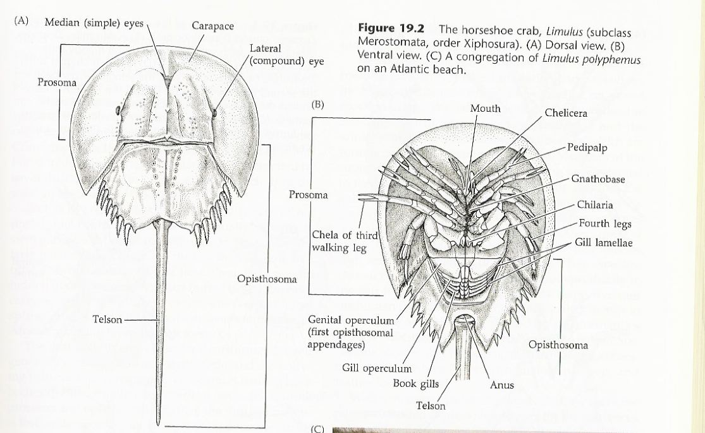

  

##### Class Pycnogonida
(taxonomic placement has been particularly problematic)  
Diversity:  approx. 1,000 species  
Entirely marine, many live on other inverts (on bells of pelagic medusa, vestimentiferan worms....)  
Important characteristics:  

* anterior **"proboscis"**; ovigers in males (used for brooding); multiple gonopores on walking legs
\
**See figure 14.13 pg 358 in your text. We have two Pycnogonids in our collection.  Be sure to see them. Return it promptly if you take it to your microscope.** 
  

#### Class Arachnida  
Diversity:  over 65,000 described species  
nearly all terrestrial  
Important Characteristics:  

* prosoma with **carapace**-like shield; without compound eyes; opisthosomal appendages absent or modified as **spinnerets** (spiders) or **pectins** (scorpions); respiration by **book lungs, tracheae** or both.

 

##### Order Scorpiones  
Important characteristics:  

* prosoma covered with **carapace**; opisthosoma divided into **mesosoma** (wide, 7 segments) and **metasoma** (narrow, 5 segments); telson with poison gland; **pedipalps** large, chelate; first mesosomal segment with **gonopore** covered with **genital operculum**;  second mesosomal segment with **pectins**; 3rd through 6th mesosomal segments with a pair of **book lungs**.

\
***Drawing 4.3	Drawing of scorpion external morphology (dorsal and ventral view)***

* Draw and label the following structures of a scorpion as in Pechenik pg 341, Fig 14.11 and the figure below:
+ + **prosoma, opisthosoma, mesasoma, metasoma, chelicerae, pedipalp, chela, genital operculum, pectins, spiracle (book lung), telson (stinger), walking legs, eyes.**

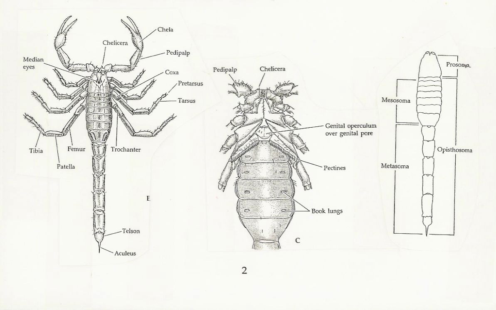
  

##### Order Araneae  
Diversity:  over 42,000 described species  
almost entirely terrestrial (one freshwater species)  
Important characteristics:  

* Prosoma undivided, covered with **carapace**, attached to opisthosoma with narrow **pedicel**; opisthosoma undivided and unsegmented (except mesothelae); chelicerae modified as **fangs, usually with venom glands; book lungs** and/or **tracheae; spinnerets** and **silk producing glands**; usually **8 eyes.**

\
***Drawing 4.4	External anatomy of spider (dorsal and ventral)***

* Each of you will draw and label structures on a spider that represents a family that is different from those drawn by the rest of the class.  If your specimen does not have an ID label, ask me what it is.  Be sure to look for the unique genitalic structures on a spider of the **opposite sex** from the individual you have drawn.  Also look for all of the listed structures on **at least one other type of spider.**  Adult males are distinguished by their **modified, swollen pedipalps.**
\
\
* **Draw and label (lateral and ventral views) the following as in Pechenik pg 355 fig 14.12 and the figure below:**  
+ + **prosoma, opisthosoma, pedipalp, chelicerae, fang, pedicel, labium, maxilla (=endites), epigastric furrow, lung slits, spinnerets, sternum, eyes.**  Be sure to see the **modified pedipalps of males** and the diversity of their forms, and **female epigynum**

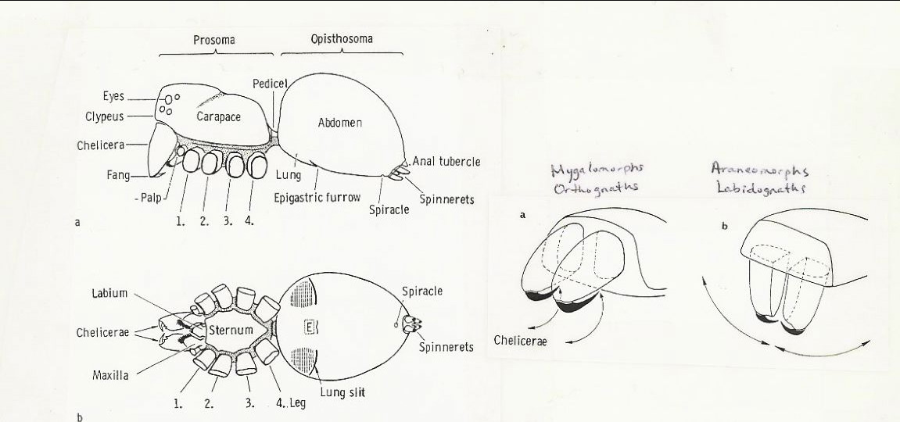
\
\
**Other interesting things to see:**  

* **tarsal claws** at tip of most distal leg segment  
* **venom duct** at tip of fang  
* **cheliceral teeth** (Theridiidae and Thomisidae don't have these)  

**Look at the diversity of live and preserved demonstration specimens.**

     

***Other Arachnid Orders***  
**Look at representatives of other Arachnid orders listed on the first page of this handout and be able to recognize each order.**  
\
Required sketches:

* *Pseudoscorpion*
* *Amblypygid*
* *Uropygid*
* *Opiliones*

\

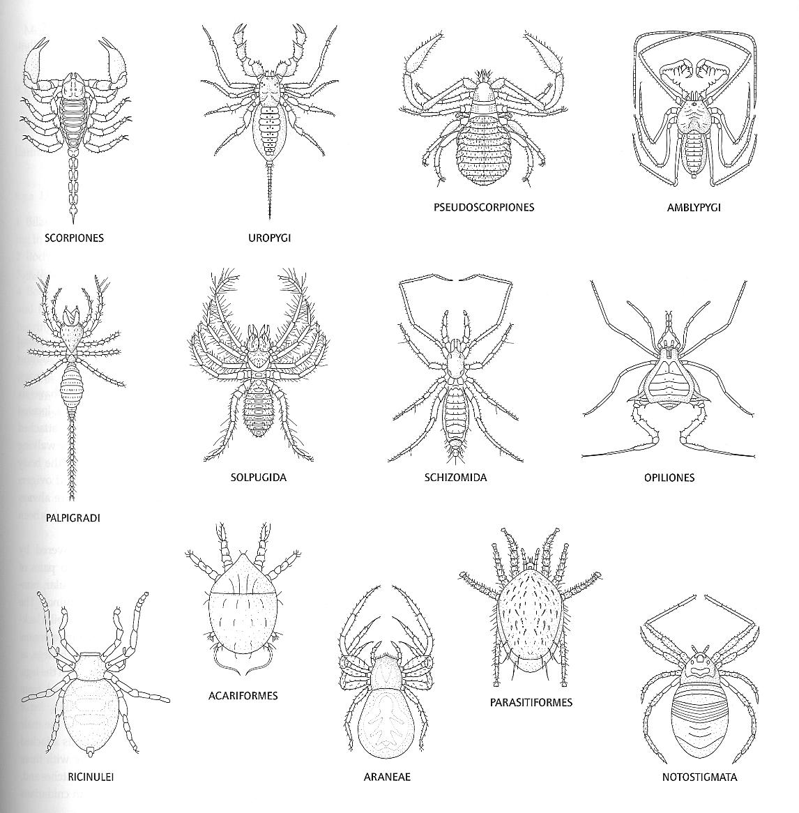  
\
Use figure 14.11 pg 353 of your text as a guide in your identification of body parts.  Notice the different degrees of tagmosis (the fusing of body segments through evolutionary time).

\
\
\
**Class Amblypygi**  
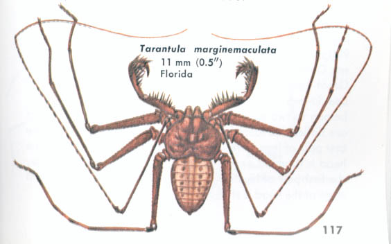  
\
\
**Class Uropygi**  
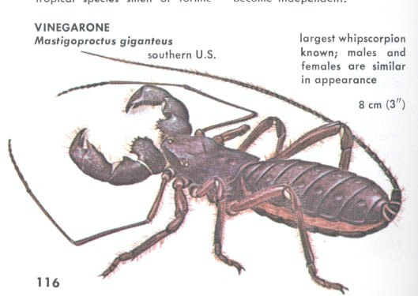  
\
\
**Class Opiliones**  
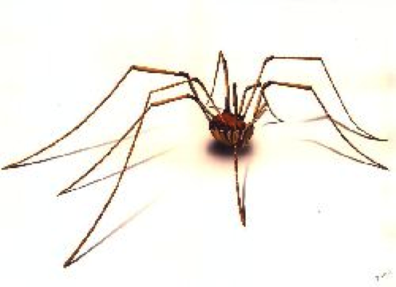  
   

##### SPIDER IDENTIFICATION – Introduction to using a dichotomous key

I will give each of your tables a spider that is unlabeled. You will work through a dichotomous key to identify the spider. 

   